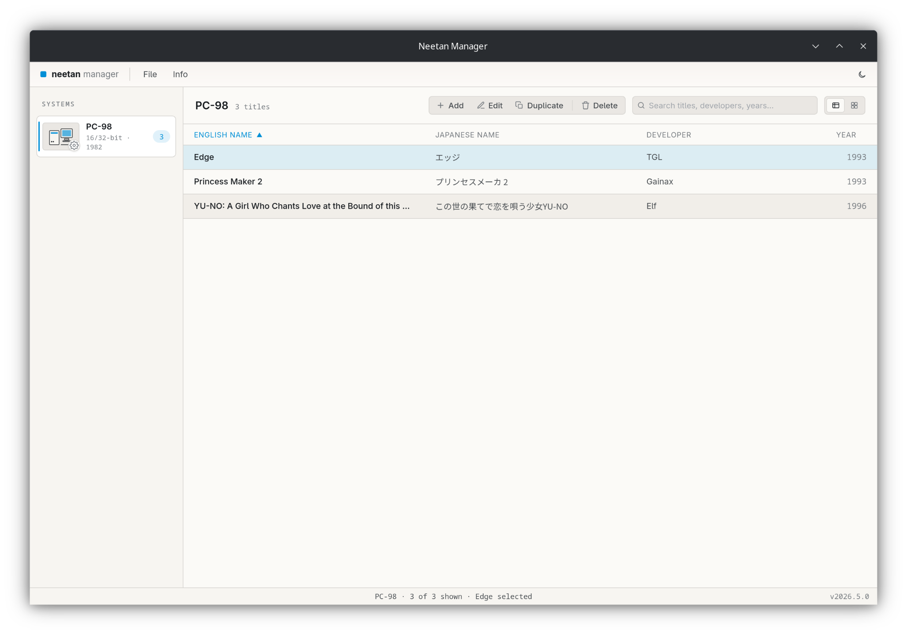
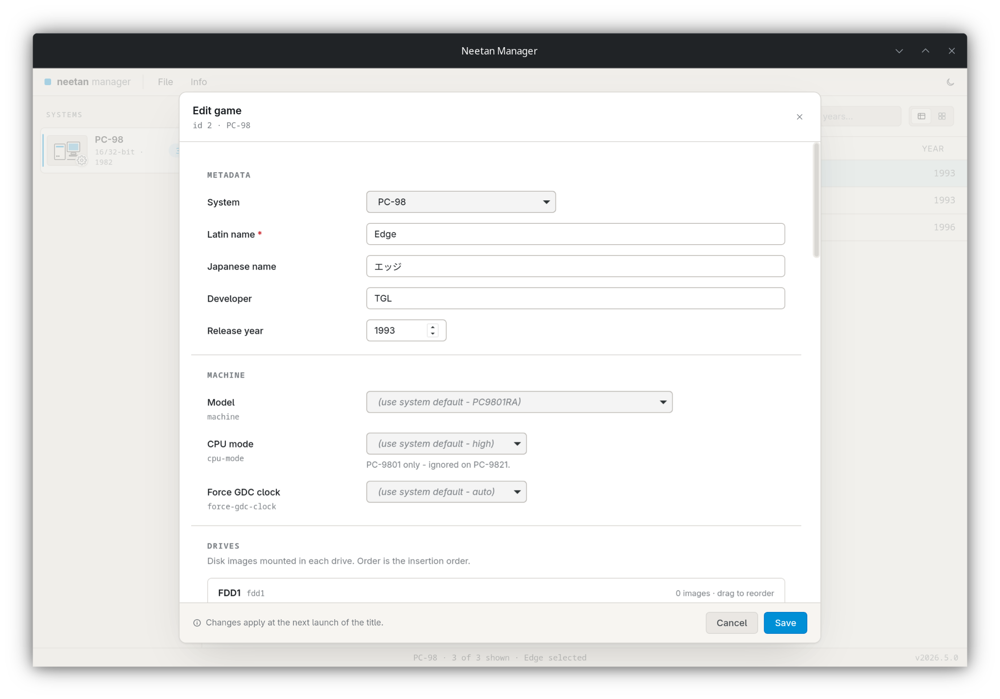

# Neetan (ねーたん) manager

A GUI application to manage configurations for the emulator Neetan.

## Screenshots

## Development

### Install dependencies

`deno install`

### Run application

`deno task tauri dev`

## License

This project is licensed under the [3-clause BSD](https://opensource.org/license/bsd-3-clause) license.
